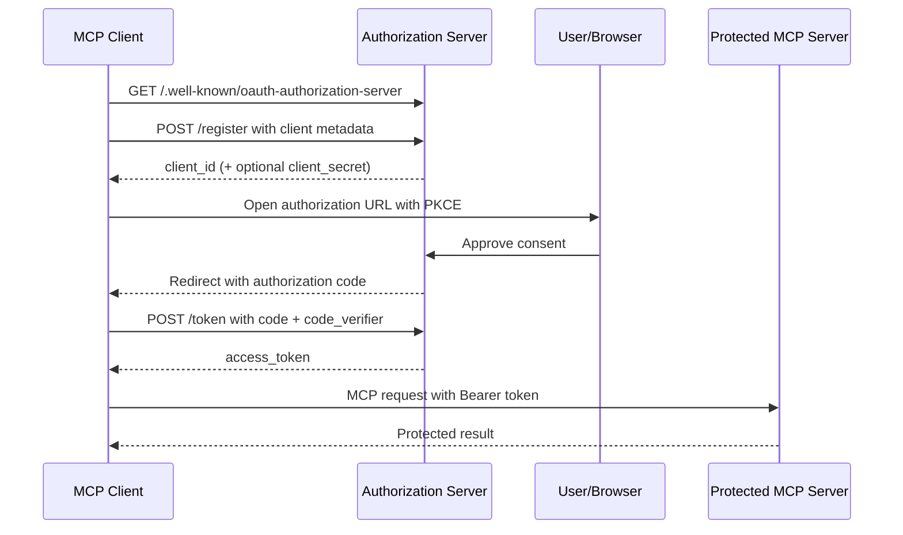
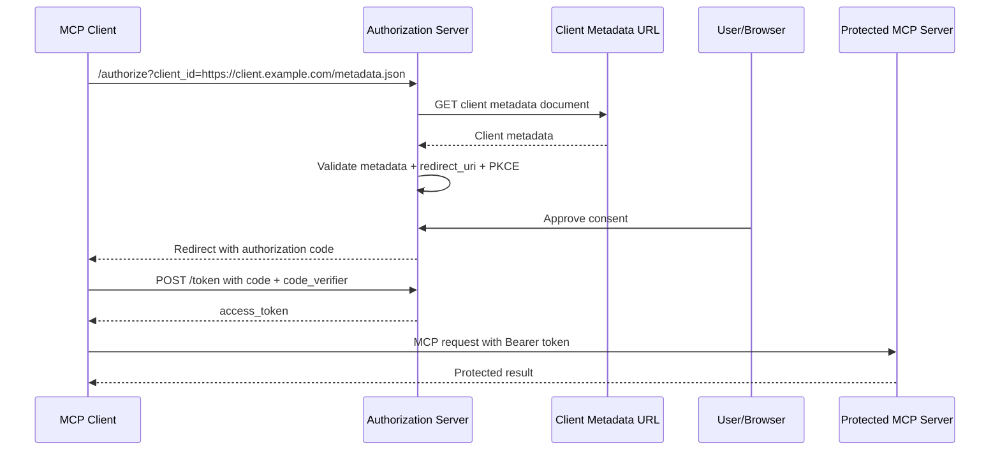

# OAuth Test Server: DCR + CIMD Full Implementation

You are a senior backend engineer working on an MCP OAuth test/reference server.
This repo is at /home/rmax-10/src/rmax-ai/mcp-auth-test-server and is already a mature
FastAPI implementation. Your job is to add the missing pieces for a complete
DCR + CIMD demonstration.

## READ THIS FIRST — Repository State

The codebase already has:
- FastAPI app at `src/mcp_auth_test_server/app.py`
- OAuth auth code + PKCE flow at `src/mcp_auth_test_server/auth/oauth.py` + `mcp/oauth_v2_3l.py`
- DCR (RFC 7591) at `src/mcp_auth_test_server/auth/dynamic_registration.py` (POST /oauth/register)
- Static CIMD fixture clients (dev-public-client, dev-confidential-client, dev-admin-client) in `token_store.py`
- In-memory OAuthTokenStore at `src/mcp_auth_test_server/auth/token_store.py`
- Audit events at `src/mcp_auth_test_server/auth/audit.py`
- Debug endpoints at `src/mcp_auth_test_server/debug.py`
- Discovery metadata at `src/mcp_auth_test_server/discovery/auth_server_metadata.py`
- MCP JSON-RPC handlers in `src/mcp_auth_test_server/mcp/`
- Tests in `tests/` using pytest + httpx
- SvelteKit + mdsvex docs site at `docs/site/`
- Ruff for lint/format, uv for package management

The current CIMD module (`src/mcp_auth_test_server/auth/cimd.py`) is **stub-only** — it resolves to
pre-seeded fixture client IDs. There's NO URL-based CIMD metadata fetch.
There are NO client-side example scripts demonstrating DCR/CIMD flows.

## WHAT TO BUILD — In This Order

Create the following files in order. DO NOT modify existing code unless explicitly
instructed.

### FILE 1: `src/mcp_auth_test_server/auth/cimd_resolver.py`

A proper CIMD metadata resolver with SSRF protection and caching.

```
AbstractClientMetadataResolver(ABC)
  resolve(client_id: str) -> ClientRecord | None
  clear_cache()
```

**Concrete implementation:** `ClientMetadataResolver`
- Takes an optional `development_mode: bool = False` parameter
- If `client_id` is NOT a URL (no scheme), delegates to the existing fixture client
  resolution via `oauth_token_store.get_client(client_id)`
- If `client_id` IS an HTTPS URL, fetches the Client ID Metadata Document:
  - SSRF protection: validate URL scheme (HTTPS only), check resolved IP against
    private/loopback/link-local ranges, limit response size (64KB), 5s timeout,
    no redirects to non-HTTPS, block metadata service IPs (169.254.169.254)
  - In `development_mode=True`, allow HTTP and localhost explicitly with a
    logged warning
  - Parse JSON body, validate required fields (client_id, redirect_uris)
  - Verify the document's `client_id` field matches the URL used to fetch it
  - Validate redirect_uris are HTTPS URLs (or localhost in dev mode)
  - Return a ClientRecord populated from the metadata
  - Cache resolved metadata with a 300-second TTL
  - Log structured debug events: "cimd_fetch_start", "cimd_fetch_hit",
    "cimd_fetch_miss", "cimd_fetch_success", "cimd_fetch_error",
    "cimd_validation_error", "cimd_ssrf_blocked"

**SSRF protection helper functions in the same file:**
- `_is_private_ip(ip_str: str) -> bool` — check 10.0.0.0/8, 172.16.0.0/12,
  192.168.0.0/16, 127.0.0.0/8, ::1, fd00::/8, fe80::/10, 169.254.169.254
- `_validate_cimd_url(url: str, dev_mode: bool) -> str` — scheme check, DNS
  resolution to check blocklist, returns validated URL string
- `_fetch_metadata(url: str, timeout: float) -> dict` — httpx GET with timeouts,
  size limits, redirect policy

**Caching:** Simple dict-based cache with TTL. Expose `get_from_cache(url) -> tuple[ClientRecord | None, bool]`
where the bool indicates "was cache hit".

### FILE 2: `src/mcp_auth_test_server/auth/trace_logger.py`

A structured OAuth trace logger for DCR and CIMD events.

```python
@dataclass
class OAuthTraceEvent:
    event_type: str  # dcr_register, dcr_validation, cimd_fetch, etc.
    client_id: str | None
    detail: str
    result: str  # success, failure, blocked
    metadata: dict[str, object] = field(default_factory=dict)
    timestamp: datetime = field(default_factory=lambda: datetime.now(UTC))

class OAuthTraceLogger:
    def __init__(self, max_events: int = 1000)
    def record(self, event: OAuthTraceEvent)
    def clear(self)
    def get_events(self, event_type: str | None = None, limit: int = 50) -> list[OAuthTraceEvent]
```

Trace event types to support:
- `dcr_register_start`, `dcr_register_success`, `dcr_register_error`
- `dcr_validation_error`
- `cimd_fetch_start`, `cimd_fetch_cache_hit`, `cimd_fetch_cache_miss`
- `cimd_fetch_success`, `cimd_fetch_error`
- `cimd_ssrf_blocked`, `cimd_validation_error`
- `authorize_request_validation`, `authorize_redirect_uri_mismatch`
- `pkce_validation_success`, `pkce_validation_failure`
- `token_exchange_success`, `token_exchange_error`
- `consent_approved`, `consent_denied`
- `authorization_code_issued_trace`, `authorization_code_reused`

Export a module-level singleton: `trace_logger = OAuthTraceLogger()`

### FILE 3: `src/mcp_auth_test_server/debug.py` — UPDATE (add trace endpoint)

Add a new endpoint `/debug/traces` that returns the trace logger's events:

```python
@router.get("/debug/traces")
async def debug_traces(event_type: str | None = None, limit: int = 50):
    """Return structured OAuth trace events from the trace logger."""
    events = trace_logger.get_events(event_type=event_type, limit=limit)
    return JSONResponse({"trace_events": [e.as_debug_dict() for e in events]})
```

Import `trace_logger` from `mcp_auth_test_server.auth.trace_logger` at the top of debug.py.

### FILE 4: `src/mcp_auth_test_server/auth/cimd_integration.py`

Integration layer that wires CIMD resolution into the existing authorization flow.

```
class CimdAuthFlow:
    def __init__(self, resolver: ClientMetadataResolver | None = None)
    def resolve_and_validate(self, client_id: str) -> ClientRecord | None
    def validate_redirect_uri(self, client: ClientRecord, redirect_uri: str) -> bool
```

This module provides:
- `is_cimd_client_id(client_id: str) -> bool` — returns True if client_id looks like a URL
- `resolve_cimd_client(client_id: str, dev_mode: bool = False) -> ClientRecord | None`
  that uses the resolver, caches, and then registers the resolved client in the
  oauth_token_store so the existing authorization code can validate it via
  `validate_registered_authorization_client()`.

The integration approach:
1. On authorization request, if client_id is a URL:
   a. Check if already in oauth_token_store (from a previous resolution)
   b. If not, resolve via ClientMetadataResolver
   c. Register the resolved client in oauth_token_store with `add_client()`
   d. Mark it as "cimd_resolved" somehow (store a separate set or use client_name prefix)
2. The existing authorize handler then validates normally

**IMPORTANT:** DO NOT modify the existing `oauth_v2_3l.py` file directly.
Instead, the integration should provide helper functions that can be called from
a new endpoint or route if needed. For now, the CIMD flow should work as follows:
- An external client calls `/oauth/authorize?client_id=https://...&...` 
- The authorize endpoint (oauthorized_v2_3l.py) currently calls
  `validate_registered_authorization_client()` which looks up the client_id in
  oauth_token_store. If client_id is a URL, this fails because it's not registered.
- We need a NEW approach: create a middleware/helper that checks if client_id
  is a CIMD URL BEFORE the existing validation, resolves it, registers it, then
  lets the existing validation pass.

Create a function `ensure_cimd_client_registered(client_id: str, dev_mode: bool = False) -> tuple[bool, str | None]`
that does the integration. Returns `(success: bool, error_message: str | None)`.

### FILE 5: `examples/dcr_client_flow.py`

A standalone Python script demonstrating the DCR client flow. Make it runnable
with `uv run python examples/dcr_client_flow.py`.

The script should:
1. Accept an optional `--base-url` argument (default: `http://127.0.0.1:8765`)
2. **Stage 1**: Discover authorization server metadata from
   `GET {base_url}/.well-known/oauth-authorization-server`
3. **Stage 2**: Register a client via DCR:
   - POST to the registration endpoint from discovery metadata
   - Include: client_name, redirect_uris (use a local callback like
     `http://127.0.0.1:9876/callback`), grant_types=["authorization_code"],
     response_types=["code"], token_endpoint_auth_method="none",
     scope="mcp:tools:list mcp:tools:echo"
   - Print the full registration response
4. **Stage 3**: Generate PKCE code verifier and challenge (S256)
5. **Stage 4**: Construct the authorization URL and print it
   - Include: response_type=code, client_id, redirect_uri, scope, state, resource,
     code_challenge, code_challenge_method=S256
   - The resource should be the MCP OAuth resource path
6. **Stage 5**: Print instructions for the user to open the URL and approve
7. **Stage 6**: Start a simple callback HTTP server on localhost:9876
   - Wait for the redirect with the authorization code
   - Print the received code, state
8. **Stage 7**: Exchange the code for a token:
   - POST to the token endpoint with: grant_type, code, redirect_uri, client_id,
     code_verifier, resource
   - Print the full token response
9. **Stage 8**: Call a protected MCP resource:
   - POST to /mcp/oauth with Authorization: Bearer <access_token>
   - JSON-RPC body: {"jsonrpc": "2.0", "method": "tools/list", "id": 1}
   - Print the response
10. Handle all errors with clear messages

Add `# /// script` header with `requires-python = ">=3.12"` and deps `["httpx"]`.

### FILE 6: `examples/cimd_client_flow.py`

A standalone Python script demonstrating the CIMD client flow. Make it runnable
with `uv run python examples/cimd_client_flow.py`.

This script:
1. Starts a temporary HTTP server to serve a Client ID Metadata Document
2. Uses the URL of that document as the client_id
3. Does NOT register via DCR — just starts the authorization
4. The authorization server should fetch the metadata from the URL

Actually, for the test server in development mode, the CIMD client flow should:
1. Accept `--base-url` (default `http://127.0.0.1:8765`) and `--dev-mode` (default True)
2. Start a local HTTP server on a random port that serves a CIMD metadata document:
   ```json
   {
     "client_id": "http://127.0.0.1:{port}/cimd-metadata.json",
     "client_name": "Example CIMD Client",
     "redirect_uris": ["http://127.0.0.1:{port}/callback"],
     "grant_types": ["authorization_code"],
     "response_types": ["code"],
     "token_endpoint_auth_method": "none",
     "scope": "mcp:tools:list mcp:tools:echo"
   }
   ```
3. Discover authorization server metadata
4. Generate PKCE
5. Construct auth URL with the CIMD URL as client_id
6. Print the URL
7. Wait for callback
8. Exchange code for token
9. Call MCP protected endpoint
10. Handle errors

### FILE 7: `tests/test_cimd_resolver.py`

Comprehensive tests for the CIMD resolver.

Tests for `src/mcp_auth_test_server/auth/cimd_resolver.py`:

**Unit tests (no network):**
- `test_reject_non_https_urls` — scheme != https is rejected
- `test_reject_private_ip` — URL resolving to 10.x.x.x blocked
- `test_reject_localhost_in_production` — http://localhost rejected
- `test_allow_localhost_in_dev_mode` — http://localhost allowed with warning
- `test_reject_link_local` — fe80:: addresses blocked
- `test_reject_metadata_service` — 169.254.169.254 blocked
- `test_valid_cimd_url_passes` — https://valid.example.com/metadata.json passes
- `test_cache_hit_returns_cached` — same URL twice returns cached
- `test_is_private_ip_helpers` — each IP range checked

**Integration tests (with mocked HTTP responses via httpx mock or respx):**
- `test_successful_metadata_fetch` — full happy path
- `test_invalid_json_response` — non-JSON response
- `test_client_id_mismatch` — document client_id != fetch URL
- `test_missing_required_fields` — metadata missing redirect_uris
- `test_redirect_uri_mismatch` — document redirect_uris not matching request
- `test_oversized_response_rejected` — >64KB response truncated/rejected
- `test_network_timeout` — fetch timeout
- `test_redirect_to_http_rejected` — HTTP redirect followed

### FILE 8: `tests/test_trace_logger.py`

Simple unit tests for the trace logger:
- `test_record_and_retrieve` — record events, retrieve by type
- `test_max_events` — old events evicted
- `test_clear` — events cleared
- `test_event_as_dict` — serialization

### FILE 9: `docs/dcr-vs-cimd.md`

Technical documentation explaining the two approaches. Use the same markdown
style as the existing docs in `docs/`. This will be copied into the website later.

Include:
- Overview section
- Direct comparison table (DCR vs CIMD) covering:
  - registration model, server state, operational complexity, security risks,
    MCP fit, enterprise governance fit, local development fit
- Server-side implementation explanation
- Client-side flow walkthrough
- Security notes (SSRF, redirect validation, PKCE requirements)
- Troubleshooting section with common errors

### FILE 10: `docs/site/src/routes/oauth-dcr-cimd/+page.svx`

New SvelteKit page for the docs website. Follow the existing pattern from
`docs/site/src/routes/reference/+page.svx` and `docs/site/src/routes/flows/+page.svx`.

Include:
- Frontmatter with title, description
- Mermaid sequence diagrams (DCR flow, CIMD flow)
- Comparison table
- Code blocks showing example usage
- Links to the scripts in examples/

The Mermaid diagrams should be:





## CRITICAL RULES

1. **DO NOT modify existing working code** unless the prompt explicitly says "UPDATE"
2. **DO NOT touch** `mcp/oauth_v2_3l.py`, `app.py`, `auth/oauth.py`, `auth/token_store.py`,
   or `auth/audit.py` — these are already working and tested
3. **Follow existing code style** — line-length=100, double quotes, type hints,
   `from __future__ import annotations`
4. **Import from existing modules** — reuse `OAuthTokenStore`, `ClientRecord`, `OAuthError`,
   `AuditEvent`, `redact` rather than creating parallel versions
5. **Write tests** for every new module. Use pytest + httpx. Mock HTTP calls with `respx`
   or `httpx_mock` (check which is available).
6. **After creating all files**, run: `uv run pytest tests/ -v --tb=short` and fix any
   failures from the new code. Do NOT break existing tests.
7. **After fixing tests**, run: `uv run ruff check src/ tests/` and fix any issues.
8. **Install test dependencies first:** `uv add --dev pytest-httpx` for HTTP mocking in tests. Use `httpx_mock` fixture in tests.
9. **After fixing tests**, run: `uv run ruff check src/ tests/` and fix any issues.
10. **After ruff**, run: `uv run ruff format src/ tests/`
11. **DO NOT run npm commands** — the docs site is a separate project
12. **Commit each file group** if possible, otherwise commit everything at the end with
     message: "feat: add CIMD resolver, trace logger, DCR/CIMD client examples, tests and docs"
13. **Stage files with git add** on the specific files, not `git add .` (worktrees can
     cause submodule issues)

## Verification

After implementation, verify by:
1. `uv run pytest tests/ -v --tb=short` — all tests pass (including existing ones)
2. `uv run ruff check src/ tests/` — no lint errors
3. `uv run ruff format src/ tests/ --check` — formatting is correct
4. `uv run uvicorn mcp_auth_test_server.app:app --port 8765` starts without import errors
5. The new files exist at the specified paths
6. `uv run python examples/dcr_client_flow.py --help` works
7. `uv run python examples/cimd_client_flow.py --help` works
