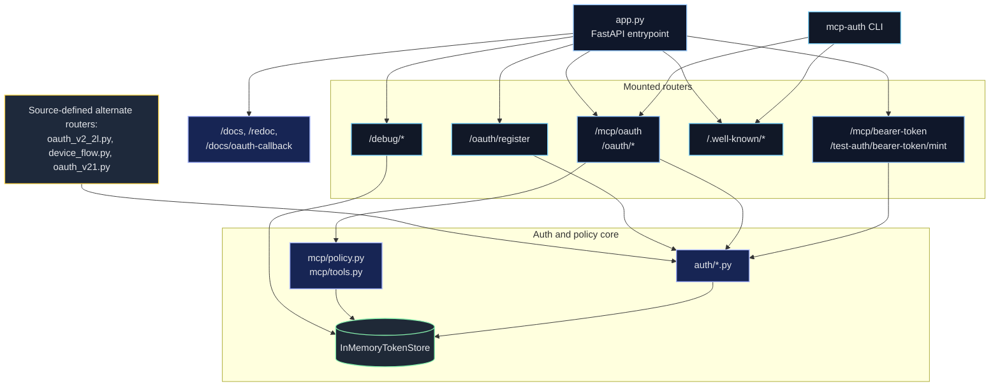
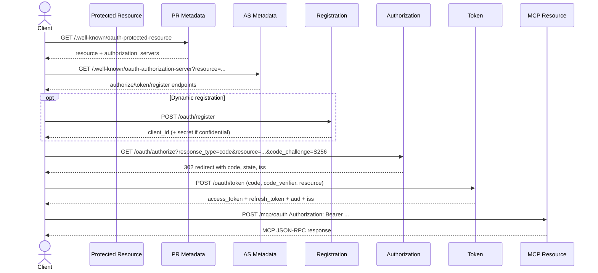

# MCP Auth Test Server

MCP Auth Test Server is a FastAPI application for exercising MCP JSON-RPC
resources across multiple auth patterns. The default app mounts:

- a static bearer-token protected MCP resource at `/mcp/bearer-token`
- a unified OAuth-protected MCP resource at `/mcp/oauth`
- OAuth discovery, authorization, token, device, registration, and debug
  endpoints around that resource

The repository also contains source-defined alternate routers for a dedicated
client-credentials MCP resource, a dedicated device-flow MCP resource, and a
dedicated OAuth 2.1 MCP resource. Those modules exist in `src/`, but `app.py`
does not mount them by default.

## Quick Start

```bash
uv sync --dev

uv run uvicorn mcp_auth_test_server.app:app --reload --port 8765

uv run pytest tests/ -v
```

## Endpoints

### Mounted by default in `app.py`

| Endpoint | Purpose |
|----------|---------|
| `/mcp/oauth` | Canonical OAuth-protected MCP JSON-RPC resource |
| `/mcp/bearer-token` | Static bearer-token MCP JSON-RPC resource |
| `/oauth/authorize` | Authorization endpoint for auth code + PKCE |
| `/oauth/authorize/consent` | Mock consent form handler for auth-code flow |
| `/oauth/token` | Token endpoint for auth code, refresh token, client credentials, and device code |
| `/oauth/device/authorize` | Device authorization endpoint |
| `/oauth/device/verify` | Mock verification UI for device flow |
| `/oauth/device/verify/consent` | Mock device verification form handler |
| `/oauth/register` | Dynamic client registration (RFC 7591) |
| `/.well-known/oauth-protected-resource` | Protected resource metadata (RFC 9728) |
| `/.well-known/oauth-authorization-server` | Authorization server metadata (RFC 8414) |
| `/test-auth/bearer-token/mint` | Mint a short-lived static bearer token for `/mcp/bearer-token` |
| `/debug/authorizations` | Issued authorization codes as redacted hashes |
| `/debug/approvals` | Recorded approval decisions |
| `/debug/tokens` | Issued access tokens as redacted hashes |
| `/debug/clients` | Registered client metadata with redacted secrets |
| `/debug/audit` | Structured audit events |
| `/health` | Health check |
| `/docs` | Swagger UI with OAuth redirect helper banner |
| `/docs/oauth-callback` | Same-origin OAuth redirect inspector for docs testing |
| `/docs/oauth2-redirect` | Swagger UI OAuth2 redirect helper |
| `/redoc` | ReDoc UI |
| `/openapi.json` | Generated OpenAPI document |

### Source-defined alternate routers present in `src/` but not mounted by default

| Endpoint | Source module | Purpose |
|----------|---------------|---------|
| `/mcp/oauth-v2-client-creds` | `src/mcp_auth_test_server/mcp/oauth_v2_2l.py` | MCP resource that only accepts client-credentials tokens |
| `/mcp/device-flow` | `src/mcp_auth_test_server/mcp/device_flow.py` | MCP resource that only accepts device-grant tokens |
| `/oauth-v21/authorize` | `src/mcp_auth_test_server/mcp/oauth_v21.py` | Dedicated OAuth 2.1 authorization endpoint |
| `/oauth-v21/authorize/consent` | `src/mcp_auth_test_server/mcp/oauth_v21.py` | Dedicated OAuth 2.1 consent handler |
| `/oauth-v21/token` | `src/mcp_auth_test_server/mcp/oauth_v21.py` | Dedicated OAuth 2.1 token endpoint |
| `/mcp/oauth-v21` | `src/mcp_auth_test_server/mcp/oauth_v21.py` | Dedicated OAuth 2.1 MCP resource |



## Supported Auth Surfaces

### Mounted surfaces

- Static bearer token at `/mcp/bearer-token`
- Authorization code + PKCE on `/oauth/authorize` and `/oauth/token`, with
  bearer access to `/mcp/oauth`
- Client credentials on `/oauth/token`, with bearer access to `/mcp/oauth`
- Device authorization grant on `/oauth/device/authorize` and `/oauth/token`,
  with bearer access to `/mcp/oauth`
- Refresh tokens for eligible auth-code and device clients

### Source-defined alternate surfaces

- Dedicated client-credentials resource in `mcp/oauth_v2_2l.py`
- Dedicated device-flow resource in `mcp/device_flow.py`
- Dedicated OAuth 2.1 router in `mcp/oauth_v21.py`

The default app does not mount those alternate routers, but they remain part of
the repository architecture and are worth documenting because they define the
broader auth test surface.

## Policy and Scope Model

The MCP server exposes a fixed tool catalog from
`src/mcp_auth_test_server/mcp/tools.py`. Each tool definition declares a
required scope:

- `echo` and `ping` declare `mcp:tools:echo`
- `whoami` and `read_note` declare `mcp:tools:read`
- `write_note` declares `mcp:tools:write`
- `dangerous_delete` declares `mcp:tools:admin`

The policy engine exists in `mcp/policy.py`, but the current mounted handlers
do not pass token scopes into `BaseMCPHandler`. In practice that means:

- per-tool scope denial is not currently active on the mounted routes
- `tools/list` currently returns the full catalog on the mounted routes
- argument policies still run before tool handlers execute

Argument policies currently enforced:

- `write_note` requires `content`, caps it at 1000 characters, and rejects
  blocked patterns such as `rm -rf`, `DROP TABLE`, and `<script>`
- `dangerous_delete` requires `confirm=true` and the environment variable
  `MCP_ALLOW_DANGEROUS`

Policy denials return JSON-RPC errors before the tool handler executes.

## CIMD Fixture Clients and Approval Modes

The in-memory token store seeds several fixed clients on startup/reset.

### CIMD-style fixture clients

| Client ID | Profile | Auth method | Grants | Notes |
|-----------|---------|-------------|--------|-------|
| `dev-public-client` | public | `none` | `authorization_code` | Public auth-code client with localhost/dev redirects |
| `dev-confidential-client` | confidential | `client_secret_post` | `authorization_code`, `client_credentials` | Confidential fixture client |
| `dev-admin-client` | admin | `client_secret_post` | `client_credentials` | Includes `mcp:tools:admin` |

The store also seeds phase-oriented clients used by tests, including
`phase-5-public-client`, `phase-6-service-client`, `phase-7-public-client`, and
`phase-11-device-client`.

### Approval modes

The shared `/oauth/authorize` flow supports three approval modes:

- `manual` - default; renders a consent page
- `auto_approve` - auto-issues a code unless an admin scope is requested
- `auto_deny` - immediately redirects with `error=access_denied`

Admin scopes (`mcp:tools:admin`) always require explicit manual confirmation.
The approval path records decisions in `/debug/approvals` and also emits audit
events.

## Debugging and Observability

The server keeps all OAuth state in memory and exposes it for inspection:

- `/debug/authorizations` shows issued authorization codes as redacted hashes
- `/debug/approvals` shows consent decisions and approval modes
- `/debug/tokens` shows issued access tokens as redacted hashes
- `/debug/clients` shows registered clients without leaking secrets
- `/debug/audit` shows structured audit events such as `registration`,
  `approval`, `authorization_code_issued`, and `token_issued`

Token and code values are redacted with a truncated SHA-256 hash prefix before
they are exposed.

## OAuth 2.1 Behavior

The mounted `/oauth` and `/mcp/oauth` surface already enforces the main stricter
behaviors associated with OAuth 2.1:

- PKCE `S256` only
- implicit grant rejected
- `resource` required for auth-code token exchange
- `iss` propagated on authorization redirects
- `aud` and `iss` preserved on issued and refreshed tokens
- `/mcp/oauth` validates both audience and issuer before serving MCP calls

The repository also includes a dedicated OAuth 2.1 router module at
`src/mcp_auth_test_server/mcp/oauth_v21.py` that defines `/oauth-v21/*` and
`/mcp/oauth-v21`. That router is not mounted by the default app.

## Not Supported

The project does not currently model:

- implicit grant success paths
- Resource Owner Password Credentials
- JWT bearer grant
- token exchange
- CIBA
- PAR, JAR, or JARM
- DPoP
- mTLS or other sender-constrained tokens
- `private_key_jwt`
- token introspection or revocation
- OIDC features such as ID tokens or userinfo

## Docs Site

The repo includes a static docs website under `docs/site`, built with
SvelteKit, `@sveltejs/adapter-static`, and mdsvex. It is deployed by
`.github/workflows/deploy-docs.yml`.

Local docs-site commands:

```bash
cd docs/site
npm install
npm run dev
npm run check
npm run build
```

## Standalone CLI

This repo also includes a standalone `mcp-auth` CLI for exercising generic MCP
auth flows against arbitrary protected resources. The CLI is resource-centric:
it discovers auth metadata, helps complete login, stores reusable local
profiles, and keeps tokens current for later MCP calls.

### Install the CLI

```bash
uv sync --dev
uv run mcp-auth --help
```

### Core commands

```bash
# Discover advertised auth capabilities for a protected resource
uv run mcp-auth discover http://127.0.0.1:8765/mcp/oauth

# Login using the best available flow, or force one explicitly
uv run mcp-auth login http://127.0.0.1:8765/mcp/oauth
uv run mcp-auth login http://127.0.0.1:8765/mcp/oauth --auth-mode device
uv run mcp-auth login http://127.0.0.1:8765/mcp/oauth --auth-mode auth-code --register
uv run mcp-auth login http://127.0.0.1:8765/mcp/bearer-token --auth-mode bearer

# Call MCP JSON-RPC methods
uv run mcp-auth call http://127.0.0.1:8765/mcp/oauth initialize
uv run mcp-auth call http://127.0.0.1:8765/mcp/oauth tools/list
uv run mcp-auth call http://127.0.0.1:8765/mcp/oauth tools/call --tool-name ping
uv run mcp-auth call \
  http://127.0.0.1:8765/mcp/oauth \
  tools/call \
  --tool-name echo \
  --tool-arguments '{"message":"hello","uppercase":true}'

# Inspect or switch saved profiles
uv run mcp-auth profile list
uv run mcp-auth profile show --resource-url http://127.0.0.1:8765/mcp/oauth

# Remove the active profile for a resource
uv run mcp-auth logout http://127.0.0.1:8765/mcp/oauth
```

### Auth modes

The CLI supports four auth modes:

- `bearer` for user-supplied opaque bearer tokens
- `auth-code` for authorization code + PKCE
- `device` for device authorization grant
- `client-creds` for confidential client credentials

For auth-code logins, the CLI defaults to a localhost callback listener on a
separate port, prints the authorization URL, and waits for the browser redirect
in the background. Use `--listen-port` to force a specific callback port.

If `--auth-mode` is omitted, `mcp-auth login` discovers the protected resource
and chooses the best available option using this order:

- an existing refreshable profile
- stored or supplied client credentials
- device flow
- authorization code flow
- manual bearer token

### Profiles and token refresh

- Profiles are stored locally with restrictive file permissions and reused on
  later commands.
- `mcp-auth call` automatically ensures there is a valid access token before
  contacting the MCP endpoint.
- For auth-code and device profiles, the CLI uses a stored refresh token when
  one is available.
- For client-credentials profiles, the CLI requests a fresh access token when
  the current one expires.
- Manual bearer profiles are never refreshed automatically; re-run `login` if a
  bearer token changes or expires.
- Use `--verbose` on `discover`, `login`, or `call` to print raw endpoint and
  protocol details.

## Flow Examples

### Authorization code + PKCE

1. Fetch `/.well-known/oauth-protected-resource`
2. Fetch the advertised authorization server metadata
3. Register or use a public client
4. Call `/oauth/authorize` with `resource=http://<host>/mcp/oauth`
5. Exchange the returned code at `/oauth/token`
6. Call `/mcp/oauth` with the returned bearer token

### Client credentials

1. Discover `/mcp/oauth`
2. Use a confidential client or register one with `client_secret_post`
3. Request a token from `/oauth/token` with `grant_type=client_credentials`
4. Call `/mcp/oauth` with the returned bearer token

### Device flow

1. Discover `/mcp/oauth`
2. Call `/oauth/device/authorize`
3. Approve the user code via `/oauth/device/verify`
4. Exchange the device code at `/oauth/token`
5. Call `/mcp/oauth` with the returned bearer token

### Static bearer

1. Use the configured static token `test-bearer-token`, or mint one at `/test-auth/bearer-token/mint`
2. Call `/mcp/bearer-token` with the returned bearer token



## Usage Notes

- Use `/mcp/oauth` when you want clients to exercise discovery, registration,
  token acquisition, refresh, and scoped MCP access in one place.
- Use `/mcp/bearer-token` when you want a simpler non-OAuth bearer test case.
- The default app's OpenAPI document intentionally reflects only mounted
  routes. Source-defined alternate routers are documented here and in
  `docs/architecture.md`, but they do not appear in `/openapi.json`.

## More Detail

See [docs/auth-schemes.md](docs/auth-schemes.md) for a deeper protocol
reference and [docs/architecture.md](docs/architecture.md) for the runtime
model.
