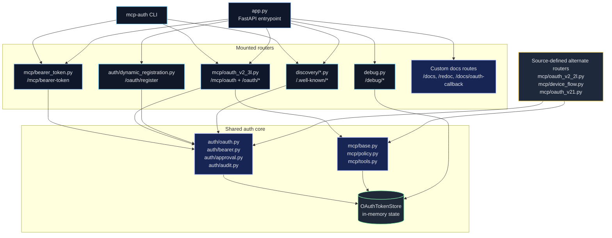
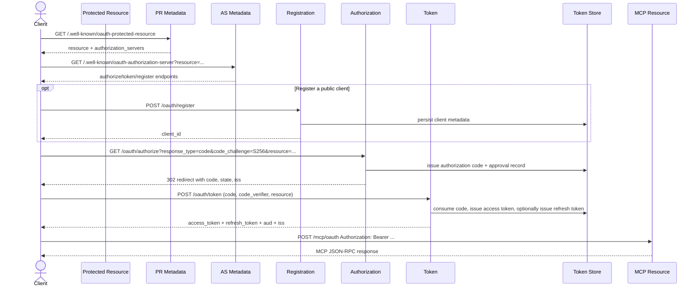

# Architecture

MCP Auth Test Server is split into two cooperating surfaces:

- `mcp_auth_test_server`: the FastAPI application and its auth/resource routers
- `mcp-auth`: the standalone CLI that discovers protected resources, logs in,
  persists profiles, and makes authenticated MCP calls

The default app favors explicitness over abstraction. Routes, token issuance,
policy checks, approvals, and audit/debug visibility are all kept observable.

## High-Level View

## Server Architecture

### Mounted routers in `app.py`

| Component | Paths | Responsibility |
|-----------|-------|----------------|
| `mcp/bearer_token.py` | `/mcp/bearer-token`, `/test-auth/bearer-token/mint` | Static bearer-token resource plus short-lived token mint helper |
| `mcp/oauth_v2_3l.py` | `/mcp/oauth`, `/oauth/authorize`, `/oauth/authorize/consent`, `/oauth/token`, `/oauth/device/authorize`, `/oauth/device/verify`, `/oauth/device/verify/consent` | Unified OAuth-protected MCP resource plus auth-code, refresh, client-credentials, and device flows |
| `auth/dynamic_registration.py` | `/oauth/register` | RFC 7591 dynamic client registration |
| `discovery/protected_resource.py` | `/.well-known/oauth-protected-resource` | RFC 9728 protected-resource metadata |
| `discovery/auth_server_metadata.py` | `/.well-known/oauth-authorization-server` | RFC 8414 authorization-server metadata |
| `debug.py` | `/debug/authorizations`, `/debug/approvals`, `/debug/tokens`, `/debug/clients`, `/debug/audit` | Read-only visibility into in-memory auth state |
| `app.py` | `/health`, `/docs`, `/redoc`, `/docs/oauth-callback`, `/docs/oauth2-redirect` | Health probe and customized documentation UIs |

### Source-defined alternate routers

These modules are part of the repository architecture but are not mounted by
the default `app.py`:

| Module | Paths | Notes |
|--------|-------|-------|
| `mcp/oauth_v2_2l.py` | `/mcp/oauth-v2-client-creds` | MCP resource that only accepts client-credentials tokens |
| `mcp/device_flow.py` | `/oauth/device/authorize`, `/oauth/device/verify`, `/oauth/device/verify/consent`, `/mcp/device-flow` | Device-grant-focused router with a dedicated MCP resource |
| `mcp/oauth_v21.py` | `/oauth-v21/authorize`, `/oauth-v21/authorize/consent`, `/oauth-v21/token`, `/mcp/oauth-v21` | Dedicated OAuth 2.1 router and protected resource |

### OpenAPI and docs customization

`app.py` customizes the OpenAPI schema and docs UI:

- adds a `MintedBearerToken` security scheme for the static bearer endpoint
- serves custom Swagger UI and ReDoc routes instead of FastAPI defaults
- injects an OAuth helper banner into Swagger UI
- provides `/docs/oauth-callback`, a same-origin redirect inspector for manual
  OAuth testing from the docs UI

## State Model

All auth state lives inside `OAuthTokenStore` in
`src/mcp_auth_test_server/auth/token_store.py`.

| Store | Contents | Debug visibility |
|-------|----------|------------------|
| `_authorization_codes` | auth-code flow codes, PKCE challenge, redirect URI, scope, resource, expiry | `/debug/authorizations` exposes redacted code hashes |
| `_device_codes` | device code, user code, verification state, scope, expiry | indirectly visible through device flow behavior and audit trail |
| `_user_codes` | lookup from user code to device code | not exposed directly |
| `_clients` | seeded fixture clients plus DCR-created clients | `/debug/clients` exposes metadata with secrets redacted |
| `_access_tokens` | issued bearer access tokens, grant type, scope, audience, issuer, expiry | `/debug/tokens` exposes redacted token hashes |
| `_refresh_tokens` | refresh token state for auth-code and device flows | not exposed directly |
| `_approval_records` | consent decisions, mode, admin confirmation state | `/debug/approvals` |
| `_audit_events` | structured audit records for OAuth and MCP activity | `/debug/audit` |

Important properties of the state model:

- everything is in memory and resettable
- test fixtures call `oauth_token_store.reset()` between tests
- reset reseeds known mock clients
- debug endpoints never return raw authorization codes or raw access tokens

## Auth Model

### Approval modes

The shared `/oauth/authorize` flow supports three consent modes from
`auth/approval.py`:

- `MANUAL` - render a consent page
- `AUTO_APPROVE` - issue a code automatically unless an admin scope is present
- `AUTO_DENY` - redirect immediately with `access_denied`

Admin scope handling is explicit:

- `has_admin_scope()` currently treats `mcp:tools:admin` as privileged
- admin scopes always require manual confirmation
- the manual consent POST path records whether `admin_confirmed=true` was
  provided

### CIMD fixture clients and DCR

The repo intentionally supports two client models:

- CIMD-style fixed clients seeded in `OAuthTokenStore`
- RFC 7591 dynamic registration via `/oauth/register`

Seeded CIMD-style fixture clients:

| Client ID | Profile | Auth method | Grants | Scope |
|-----------|---------|-------------|--------|-------|
| `dev-public-client` | public | `none` | `authorization_code` | list, echo, read, write |
| `dev-confidential-client` | confidential | `client_secret_post` | `authorization_code`, `client_credentials` | list, echo, read, write |
| `dev-admin-client` | admin | `client_secret_post` | `client_credentials` | list, echo, read, write, admin |

Additional seeded test clients include:

- `phase-5-public-client`
- `phase-6-service-client`
- `phase-7-public-client`
- `phase-11-device-client`

Dynamic registration enforces:

- supported auth methods: `none`, `client_secret_post`
- supported grant types: `authorization_code`, `refresh_token`,
  `client_credentials`, `urn:ietf:params:oauth:grant-type:device_code`
- redirect URI requirements for auth-code clients
- auth-method requirements for client credentials and device code clients

### Declared scope model

All mounted MCP resources use the same tool catalog from `mcp/tools.py`.

| Tool | Required scope |
|------|----------------|
| `echo` | `mcp:tools:echo` |
| `ping` | `mcp:tools:echo` |
| `whoami` | `mcp:tools:read` |
| `read_note` | `mcp:tools:read` |
| `write_note` | `mcp:tools:write` |
| `dangerous_delete` | `mcp:tools:admin` |

The scope model is declared in the tool metadata, but the default mounted
handlers do not currently pass token scopes into `BaseMCPHandler`. As a result,
the scope model is present in code without being fully wired into the mounted
request path.

## Policy Engine

The policy layer is split between:

- `mcp/base.py` for JSON-RPC dispatch and tool invocation
- `mcp/policy.py` for scope checks and argument validation
- `mcp/tools.py` for the tool catalog, scope mappings, and argument-policy data

### Scope checks

- `check_tool_scope()` can deny tool calls when the caller provides a token
  scope
- `filter_tools_by_scope()` can limit `tools/list` output when a token scope is
  supplied
- the current mounted request path does not pass `token_scope` into
  `BaseMCPHandler`, so scope checks are effectively bypassed on default routes
- argument-policy enforcement does still run because it does not depend on
  `token_scope`

### Argument validation

| Tool | Policy |
|------|--------|
| `write_note` | requires `content`, enforces `content` max length 1000, blocks `rm -rf`, `DROP TABLE`, and `<script>` |
| `dangerous_delete` | requires `confirm`, enforces `confirm == true`, and requires env var `MCP_ALLOW_DANGEROUS` |

The `dangerous_delete` handler itself only returns a `"would_execute"` payload;
the meaningful enforcement happens in the policy layer before the handler runs.

## Audit System

`auth/audit.py` defines `AuditEvent`, the structured event model used for
debugging and traceability.

The event model defines fields for event types such as:

- `registration`
- `approval`
- `authorization_code_issued`
- `token_issued`
- `mcp_request`
- `policy_denied`

Redaction behavior:

- `redact(value)` returns the first 12 hex characters of a SHA-256 digest
- debug endpoints expose `token_hash` and `code_hash`, never raw secrets

Current audit data sources:

- `OAuthTokenStore` appends debug-visible events for registration, approvals,
  authorization codes, and tokens
- MCP handlers build `RequestAuditContext` and log request metadata such as
  endpoint, caller, client ID, scope, grant type, audience, and issuer through
  the audit logger

## CLI Shape

The standalone `mcp-auth` CLI is resource-centric rather than server-centric:

1. Discover a protected resource
2. Fetch one or more advertised authorization servers
3. Select an auth mode
4. Complete login and persist a profile
5. Refresh or reacquire tokens as needed before an MCP call

The CLI supports:

- manual bearer tokens
- authorization code + PKCE
- device authorization grant
- client credentials

Profile behavior:

- profiles store resource URLs, auth mode, discovery metadata, tokens, and
  client-registration data when applicable
- auth-code and device profiles refresh when refresh tokens are available
- client-credentials profiles reacquire access tokens when expired
- manual bearer profiles are never refreshed automatically

## Auth-Code + PKCE Flow

