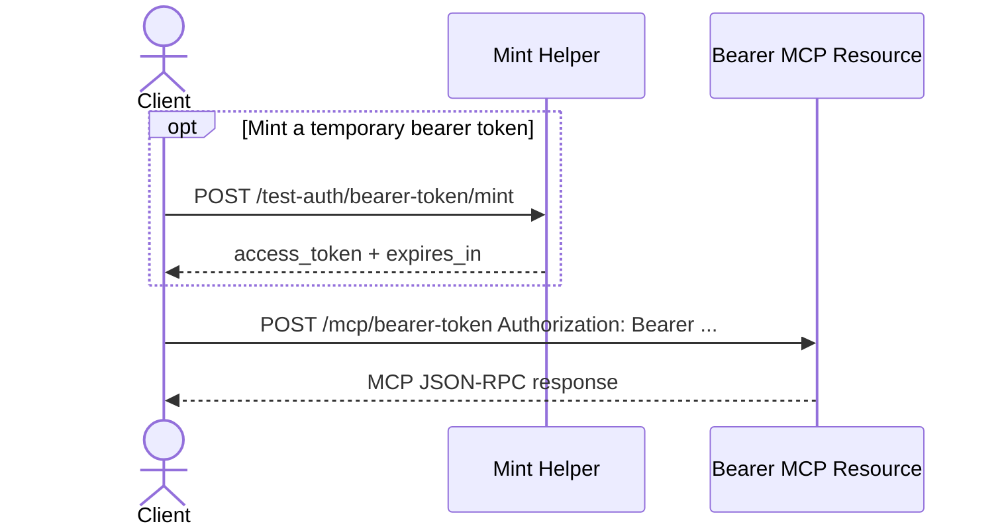
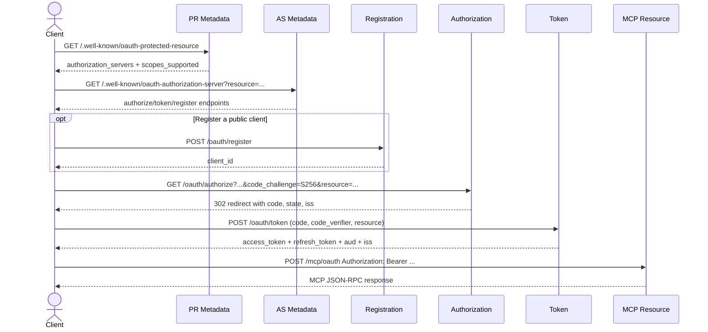
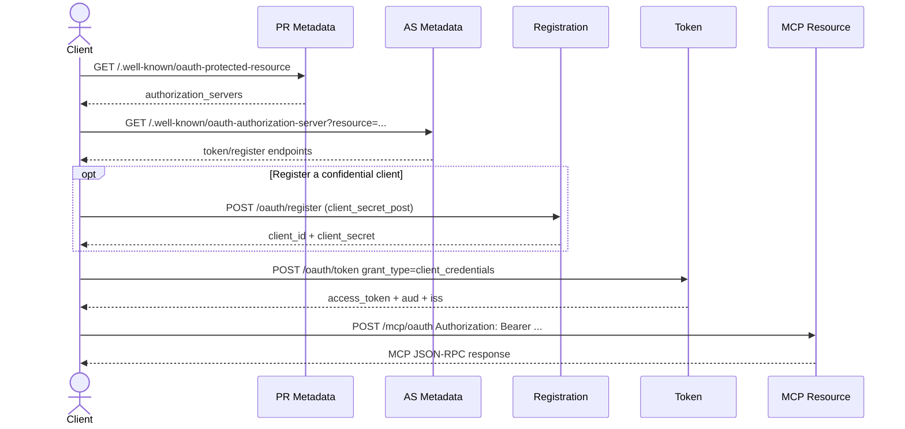
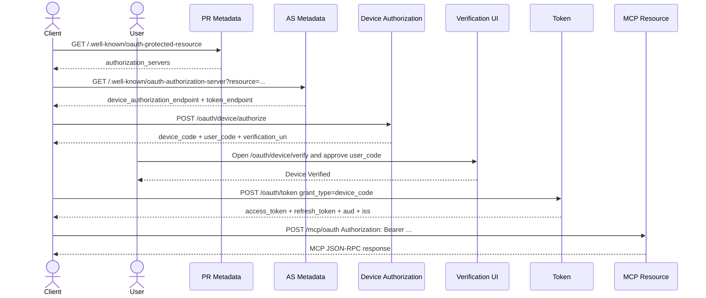
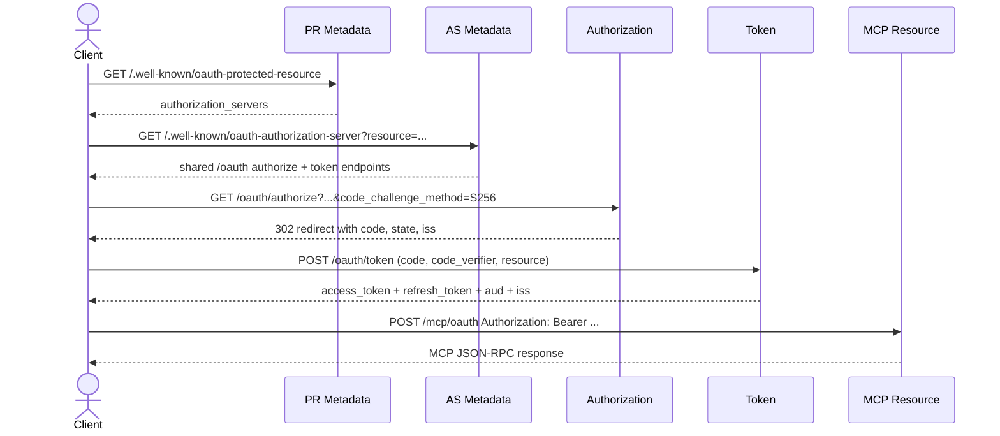

# MCP Auth Test Server Auth Schemes Reference

This document describes the auth surfaces present in the repository and how
they relate to the default mounted FastAPI app.

## At a Glance

### Mounted by default

| Resource | Token source | Notes |
|----------|--------------|-------|
| `/mcp/bearer-token` | static configured bearer token or `/test-auth/bearer-token/mint` | no OAuth discovery |
| `/mcp/oauth` | `/oauth/token` | shared OAuth resource for auth code, refresh, client credentials, and device grants |

### Source-defined alternate resources

| Resource | Source module | Status |
|----------|---------------|--------|
| `/mcp/oauth-v2-client-creds` | `mcp/oauth_v2_2l.py` | not mounted by `app.py` |
| `/mcp/device-flow` | `mcp/device_flow.py` | not mounted by `app.py` |
| `/mcp/oauth-v21` | `mcp/oauth_v21.py` | not mounted by `app.py` |

## Bearer Token Scheme

**Protected resource:** `/mcp/bearer-token`  
**Mint helper:** `/test-auth/bearer-token/mint`

Behavior:

- accepts the configured static token from `MCP_AUTH_TEST_SERVER_BEARER_TOKEN`
- falls back to `test-bearer-token` when the env var is unset
- also accepts short-lived minted tokens prefixed with `static_`
- minted tokens expire after 300 seconds
- returns RFC 6750-style `WWW-Authenticate` challenges on failure

## OAuth 2.0 Authorization Code + PKCE

**Protected resource:** `/mcp/oauth`  
**Discovery:** `/.well-known/oauth-protected-resource`,
`/.well-known/oauth-authorization-server`  
**Auth endpoints:** `/oauth/authorize`, `/oauth/authorize/consent`,
`/oauth/token`

Mounted behavior:

- authorization requests must use `response_type=code`
- implicit (`response_type=token`) is rejected
- PKCE is mandatory and only `S256` is accepted
- `resource` is required and must match the canonical `/mcp/oauth` URL
- token issuance preserves `aud` and `iss`
- `/mcp/oauth` validates token audience and issuer before dispatching MCP
  methods

Client restrictions on the mounted shared surface:

- `/oauth/authorize` requires a registered public client
  (`token_endpoint_auth_method=none`)
- `/oauth/token` auth-code exchange also requires a public client

Useful built-in clients:

- `phase-5-public-client`
- `phase-7-public-client`
- `dev-public-client`

## OAuth 2.0 Client Credentials

**Mounted token endpoint:** `/oauth/token`  
**Mounted MCP resource:** `/mcp/oauth`  
**Alternate dedicated MCP resource:** `/mcp/oauth-v2-client-creds` in
`mcp/oauth_v2_2l.py` (not mounted by default)

Mounted behavior:

- `grant_type=client_credentials`
- requires `client_secret_post`
- issued access tokens target the canonical `/mcp/oauth` audience
- client-credentials tokens can call the mounted `/mcp/oauth` resource

Useful built-in clients:

- `phase-6-service-client`
- `dev-confidential-client`
- `dev-admin-client`

## OAuth 2.0 Device Authorization Grant

**Mounted endpoints:** `/oauth/device/authorize`, `/oauth/device/verify`,
`/oauth/device/verify/consent`, `/oauth/token`, `/mcp/oauth`  
**Alternate dedicated MCP resource:** `/mcp/device-flow` in
`mcp/device_flow.py` (not mounted by default)

Mounted behavior:

- registered clients request `device_code` and `user_code`
- users complete verification in the mock browser UI
- `/oauth/token` returns `authorization_pending` until verification is complete
- successful exchange yields an access token for `/mcp/oauth`
- refresh tokens are issued when the client is also registered for
  `refresh_token`

Useful built-in client:

- `phase-11-device-client`

## OAuth 2.1

The default mounted `/oauth` and `/mcp/oauth` route set already enforces the
main OAuth 2.1-style restrictions:

- `response_type=code` only
- PKCE `S256` only
- `resource` is required for auth-code exchange
- authorization redirects include `iss`
- access and refresh flows preserve `aud` and `iss`
- `/mcp/oauth` rejects wrong audience or issuer

The repository also contains a dedicated OAuth 2.1 router module at
`mcp/oauth_v21.py` with these paths:

- `/oauth-v21/authorize`
- `/oauth-v21/authorize/consent`
- `/oauth-v21/token`
- `/mcp/oauth-v21`

That router is source-defined but not mounted by the default app, and the
default discovery endpoints do not currently advertise `/oauth-v21/*`.

## Policy

The repository defines a scope model and an argument-policy engine, but the
current mounted MCP request path does not pass `token_scope` into
`BaseMCPHandler`. That means the scope declarations below are present in code
without being actively enforced on the mounted routes today. Argument policies
are still enforced.

### Tool scopes

| Tool or method | Scope behavior |
|----------------|----------------|
| `tools/list` | intended to filter by token scope, but currently returns the full catalog on mounted routes |
| `echo` | declares `mcp:tools:echo` |
| `ping` | declares `mcp:tools:echo` |
| `whoami` | declares `mcp:tools:read` |
| `read_note` | declares `mcp:tools:read` |
| `write_note` | declares `mcp:tools:write` |
| `dangerous_delete` | declares `mcp:tools:admin` |

### Argument policies

| Tool | Policy |
|------|--------|
| `write_note` | `content` required, `content` max length 1000, blocked patterns `rm -rf`, `DROP TABLE`, `<script>` |
| `dangerous_delete` | `confirm` required, `confirm` must equal `true`, env var `MCP_ALLOW_DANGEROUS` must be set |

### Environment-gated tools

`dangerous_delete` is the only environment-gated tool in the current catalog.
Even with the right scope, policy enforcement rejects the call unless
`MCP_ALLOW_DANGEROUS` is present.

## Approval Modes

The mounted auth-code flow supports three consent modes:

| Mode | How to trigger | Result |
|------|----------------|--------|
| `manual` | default | render consent UI, then approve or deny |
| `auto_approve` | `auto_approve=true` or `approval_mode=auto_approve` | issue code automatically unless admin scope is requested |
| `auto_deny` | `approval_mode=auto_deny` | redirect immediately with `access_denied` |

Admin scope behavior:

- any request containing `mcp:tools:admin` counts as an admin request
- admin requests bypass `auto_approve` and require explicit manual consent
- the consent POST path requires `admin_confirmed=true` for approval to stick

All approval outcomes are recorded in `/debug/approvals` and `/debug/audit`.

## CIMD Fixture Clients

`auth/cimd.py` exposes the well-known client IDs used by the repo's static
client model.

| Client ID | Profile | Auth method | Grants | Redirects |
|-----------|---------|-------------|--------|-----------|
| `dev-public-client` | public | `none` | `authorization_code` | `http://localhost:3000/callback`, `https://dev.example/callback` |
| `dev-confidential-client` | confidential | `client_secret_post` | `authorization_code`, `client_credentials` | `http://localhost:3000/callback` |
| `dev-admin-client` | admin | `client_secret_post` | `client_credentials` | none |

Profile mapping from `auth/cimd.py`:

- `dev-public-client` -> `public`
- `dev-confidential-client` -> `confidential`
- `dev-admin-client` -> `admin`
